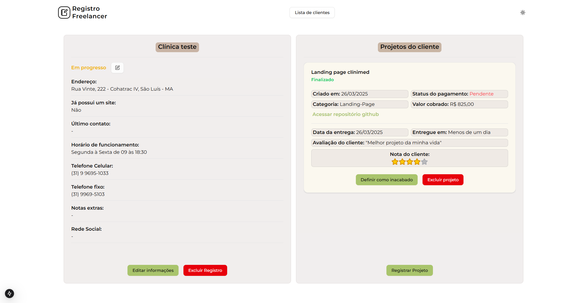

# Projeto de cadastro de serviços Freelancer

Tecnologias utilizadas




## Sumário

- [Regras de Negócio][#regras-de-negocio]
- [Imagens](#imagens)
- [Como executar o projeto](#como-executar-o-projeto)
- [Autor do Projeto](#autor-do-projeto)

## Regras de Negócio

- [x] Deve ser possível cadastrar novos clientes
- [x] Deve ser possível excluir clientes
- [x] O Status do cliente pode ser alterado
- [x] Deve ser possível cadastrar projetos para o cliente
- [x] Deve ser possível definir o projeto com concluído ou desfazer essa ação
- [x] Deve ser possível pesquisar clientes cadastrados pelo nome

## Imagens

- Lista de clientes. Carrega somente 10 clientes por vez para melhor desempenho.


- Criação de um novo projeto na parte de detalhes do cliente. É possível criar vários projetos para o mesmo cliente e administrá-los separadamente.


- Ao concluir um projeto o status dele muda para `concluído`e é possível definir uma avaliação e análise.


- É possível excluir tanto um registro de um projeto quanto o registro de um cliente, ao digitar o texto indicado corretamente para confirmação. Assim o registro é removido do banco de dados.


## Como executar o projeto

1. Instalar as dependencias

```terminal
npm install
```

2. Criar o arquivo `.env` e seguir o modelo `.env.example` de quais variáveis ambiente são necessárias

3. Caso deseje utilizar o banco de dados no container docker:
   - Criar o container
   - Listar todos os containers, copiar o ID do que queremos executar e rodar o comando de inicialização:

Criar o container

```terminal
docker compose up -d
```

Listar os containers já criados na sua máquina

```terminal
docker ps - a
```

Copiar o ID e executar este comando

```terminal
docker start [id-do-container]
```

4. Migrar o schema e as migrations para o banco de dados

```terminal
npx prisma migrate deploy
```

5. Executar o projeto

```terminal
npm run dev
```

## Autor do projeto

- GitHub - [Felipe Santiago Morais](https://github.com/SantiagoMorais)
- Linkedin - [Felipe Santiago](https://www.linkedin.com/in/felipe-santiago-873025288/)
- Instagram - [@felipe.santiago.morais](https://www.instagram.com/felipe.santiago.morais)
- Email - <a href="mailto:contatofelipesantiago@gmail.com" target="blank">contatofelipesantiago@gmail.com</a>
- <a href="https://api.whatsapp.com/send?phone=5531996951033&text=Hi%2C%20Felipe%21%20I%20got%20your%20contact%20from%20your%20github.">Whatsapp</a>
